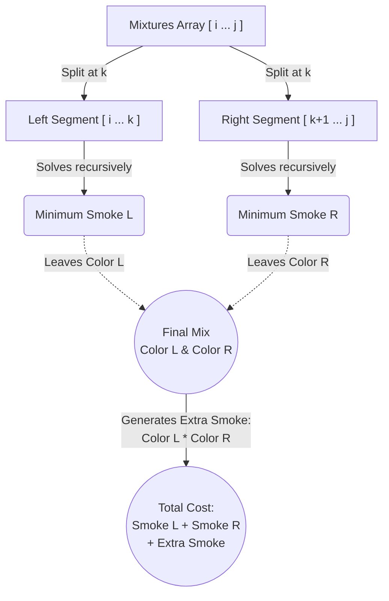

# SPOJ - MIXTURES (Harry Potter and Mixtures)

## Problem Statement 🪄
Harry Potter ke paas ek row mein $n$ mixtures rakhe hain. Har mixture ka ek color hota hai jo $0$ se $99$ ke beech hai. 
Harry ko inn sabhi mixtures ko mila kar sirf **ek mixture** banana hai. 
Lekin mix karne ka ek rule hai:
1. Tum sirf **adjacent (aas-paas waale)** mixtures ko hi mix kar sakte ho.
2. Jab tum color $a$ aur color $b$ ko mix karte ho, toh naye mixture ka color **$(a + b) \% 100$** ban jata hai.
3. Jab tum inko mix karte ho, toh **smoke (dhuaan)** release hota hai. Smoke ki amount hoti hai: **$a \times b$**.

**Goal:** Hamein sabhi mixtures ko aise sequence mein mix karna hai ki nikalne wala **total smoke minimum ho**.

---

## Approach (Karna kya hai?) 🧠
Ye problem bilkul **Matrix Chain Multiplication (MCM)** ka bhai hai! Jaise usme hum decide karte the ki matrices ko kahan se split karein (with pointer $k$), waise hi yahan bhi hume choose karna hai ki array ko kis jagah se split karke pehle mix karein.

Aao isko detail mein samajhtein hain:

### 1. State Define Karna (DP State)
Maan lo hamara ek sub-problem hai array ke index `i` se lekar `j` tak mixtures ko mix karna. 
Humara function hoga `function(arr, i, j)` jo return karega **minimum smoke** jo index `i` se `j` tak mix karke nikalta ho.

### 2. Recurrence Relation (Kaise todenge problem ko?)
Hume index `i` se `j` tak ko mix karne ke liye array ko kisi point `k` par split karna padega:
1. Left part: `i` se lekar `k` tak
2. Right part: `k+1` se lekar `j` tak

Dono parts ko pehle alag-alag mix kar lenge:
- Left part mix karne me humo smoke milega: `function(i, k)`
- Right part mix karne me smoke milega: `function(k+1, j)`

Jab dono parts independently single mixtures me badal jaayenge, toh Left part ka koi resulting color bachega, aur Right part ka bhi apna koi resulting color banega. 
- Maan lo Left part (i to k) ko mix karne par resulting color aaya: `color(i, k)`
- Right part (k+1 to j) ko mix karne par resulting color aaya: `color(k+1, j)`

Toh aakhir mein in dono resulting mixtures ko aapas mein milane par ek aur naya smoke niklega: 
`Extra Smoke = color(i, k) * color(k+1, j)`

**Total Smoke for a specific split $k$ :**
```cpp
Total_Smoke_at_k = function(i, k) + function(k+1, j) + (color(i, k) * color(k+1, j))
```

Hamara total answer kya hoga? **Minimum** of all possible splits $k$ ($i \le k < j$).

---

## Visualizing the MCM Split 🖼️

Yahan `i` se `j` tak ke mixtures ko `k` split par kaise mix kiya gaya hai, iska flowchart dhyan se dekho:



### color() Helper Function kaise kaam karta hai? 🎨
Pehle ke elements ko mix karne k baad final color simply sabhi elements ka mod-sum hi nikal ke aata hai!
Jaise:
Color of elements from $i$ to $j$:
`color(i, j) = (arr[i] + arr[i+1] + ... + arr[j]) % 100`
(*Ye humne code me `g()` function k zariye implement kiya hai*)

---

## Code Breakdown 👨‍💻

Tumhari approach kaafi simple aur tagdi thi, jisme kuch minor improvements kiye gye hain:

```cpp
// DP Array setup (initialize with -1 before calling the function)
int dp[105][105];

// Helper Function - segment ka final color batata hai
int g(const vector<int>& arr, int i, int j) {
    int result = 0;
    for (int k = i; k <= j; k++) {
        result = (result % 100 + arr[k] % 100) % 100;
    }
    return result;
}

// Main DP Function (MCM Logic)
int function(const vector<int>& arr, int i, int j) {
    if (i >= j) { 
        return 0; // Single mixture hai toh no smoking bro! 🚭
    }
    if (dp[i][j] != -1) { 
        return dp[i][j]; // Memoization
    }
    
    int ans = INT_MAX;
    
    // Trying all possible splits (k)
    for (int k = i; k < j; k++) {
        int left_smoke = function(arr, i, k);
        int right_smoke = function(arr, k + 1, j);
        int extra_smoke = g(arr, i, k) * g(arr, k + 1, j);
        
        ans = min(ans, left_smoke + right_smoke + extra_smoke);
    }
    
    return dp[i][j] = ans; // State save karo
}
```

### Time Complexity ⏳
- States in DP: $O(n^2)$ (kyunki $i$ aur $j$ pointers hain)
- Har state pe hum $k$ wala loop lagate hain jisme internally array element ko sum (func `g()`) karne me time lagta hai. 
- Over all time complexity: **$O(n^3)$** aaram se kaam karega. Maximum constrain $n = 100$ hai jisme roughly $\approx 10^6$ operations honge, hence SPOJ pe smoothly pass hoga (0.01 seconds me!)

### Space Complexity 💾
- Ek 2D Grid Table use kari hai `dp[105][105]` aur recursion internal stacks memory total space le aegi: **$O(n^2)$**
